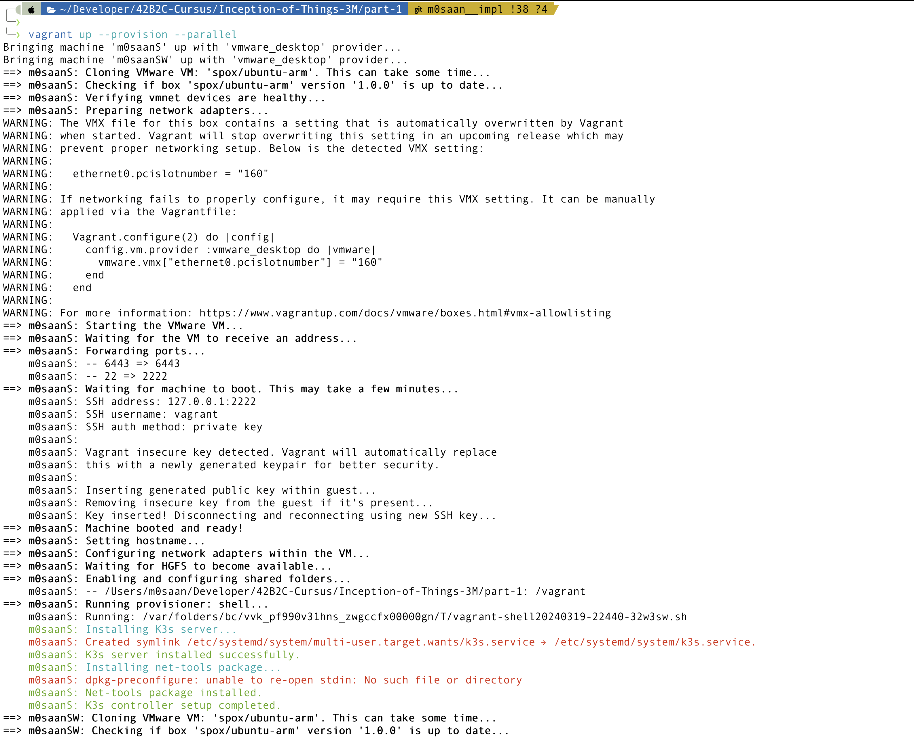
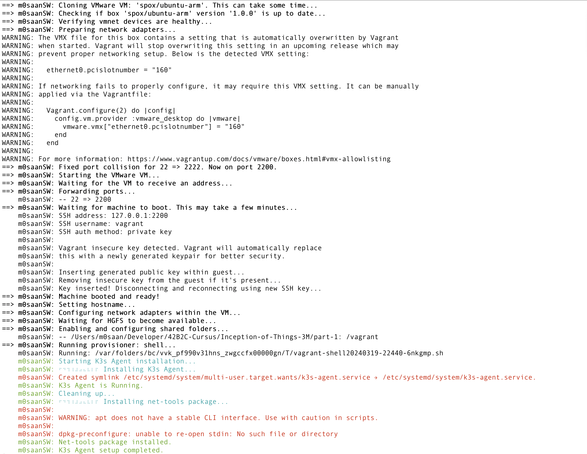
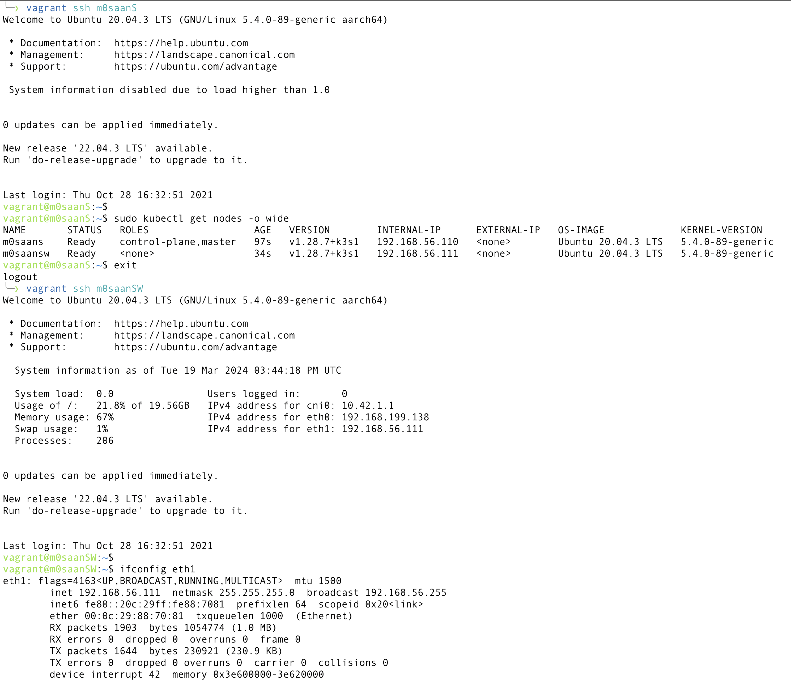

# Inception-of-Things

This project aims to introduce you to Kubernetes from a developer perspective. You will set up small clusters and discover the mechanics of continuous integration. At the end of this project, you will be able to have a working cluster in Docker and a usable continuous integration setup for your applications.

## Installation

Clone the project

```bash
git clone https://github.com/m0saan/Inception-of-Things-3M.git
```

Go to the project directory

```bash
cd Inception-of-Things-3M
```

Install dependencies
- [Vagrant](https://www.vagrantup.com/)
- [VMWare Fusion](https://www.vmware.com/products/fusion.html)    

## [Part 1: Setting up a K3s cluster with Vagrant](https://github.com/m0saan/Inception-of-Things-3M/tree/m0saan__impl/part-1)

Inside the folder Part-1, this Vagrantfile and associated scripts are used to set up a Kubernetes cluster with one controller node and one worker node using the K3s lightweight Kubernetes distribution.

### Step 1: Create the VMs
- Run `vagrant up` in the project directory to create the VMs. This will create two VMs named **m0saanS** and **m0saanSW** with dedicated IPs on the eth1 interface.
The IP of the first machine (Server) will be `192.168.56.110`, and the IP of the second machine (Worker) will be `192.168.56.111`.

### Step 2: Access the cluster
- SSH into the **m0saanS** VM using `vagrant ssh m0saanS`
- Use `kubectl` commands to interact with the cluster `sudo kubectl get nodes -o wide`.

## Screenshots



